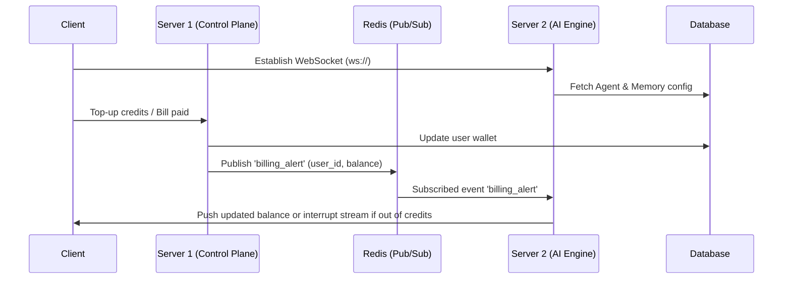
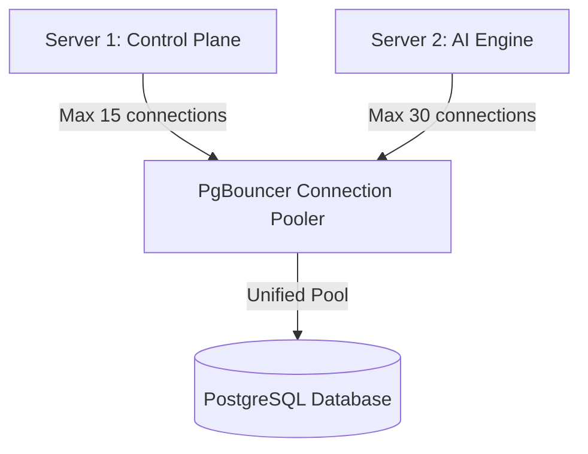
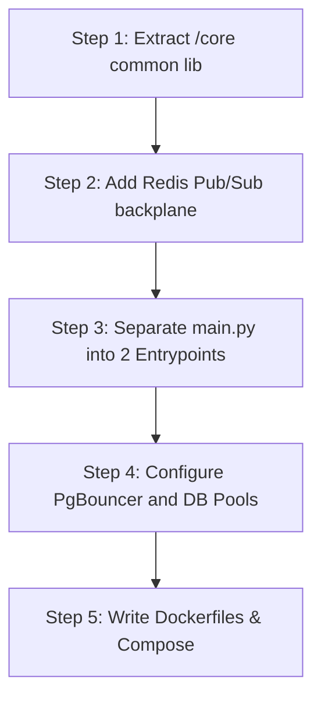

# 🏗️ BlinkBot Microservices Decoupling Report

## 1. Executive Summary
*   **Current Decoupling Readiness Score:** **5 / 10**
*   **Primary Blockers:**
    1.  **In-Memory Session & WebSocket Coupling:** The `active_sessions_map` (storing LangGraph state, LLM/tool factories, and token track cache) and WebSocket connection mappings (`AgentConnectionManager`, `NotificationWebSocketManager`) are currently stored in local server memory. If we split the servers, a WebSocket client connected to Server 2 cannot easily receive notifications or wallet changes triggered by requests hitting Server 1.
    2.  **Monolithic Route Registration & Shared State:** `main.py` acts as a single gateway registering all API routers and lifecycle tasks (such as preloading heavy models and database migrations). There is no distinct package structure for common utility libraries, schemas, or database wrappers, making direct separation of code imports difficult.
    3.  **Hardcoded Database Connection Pooling:** The database layer in [database.py](file:///home/mp3949/Documents/RAGMate/server-python/database.py) utilizes a hardcoded `ThreadedConnectionPool(1, 30)` which is shared implicitly. Running two instances of the application on the same DB instance without connection tuning risk database connection pool exhaustion.

---

## 2. Component Routing Matrix

| Module Name | Destination | Reasoning |
| :--- | :--- | :--- |
| **`auth.py` / `oauth.py`** | Server 1 (Control Plane) | Handles user authentication, token issuance, password resets, and third-party login providers. |
| **`billing.py`** | Server 1 (Control Plane) | Manages subscription tiers, plans, checkouts, and processes credits / wallets. |
| **`workspaces.py`** | Server 1 (Control Plane) | Handles lightweight workspace management CRUD. |
| **`analytics.py`** | Server 1 (Control Plane) | Aggregates user metrics, message stats, and token usage reports. |
| **`admin.py`** | Server 1 (Control Plane) | Administrative dashboard actions and system oversight. |
| **`settings.py`** | Server 1 (Control Plane) | CRUD for user settings, preferences, and personal API keys. |
| **`models.py`** | Server 1 (Control Plane) | CRUD operations for managing `system_ai_models` and `user_ai_models`. |
| **`demo.py`** | Server 1 (Control Plane) | Sandbox environment setup and mock databases. |
| **`chat_history.py`** | Server 1 (Control Plane) | Fetches historical session lists and past messages for display in dashboards. |
| **`chat.py`** | Server 2 (AI Engine) | Hosts real-time bidirectional WebSocket connections for active agent conversations. |
| **`chatbots.py`** | Server 2 (AI Engine) | Powers embedded chatbot widget sessions and real-time execution. |
| **`agents.py`** | Server 1 (Control Plane CRUD) & Server 2 (Runtime) | Configuration of agents happens on Server 1, but multi-agent execution runs on Server 2. |
| **`meta_agent.py`** | Server 2 (AI Engine) | Coordinates heavy multi-agent executions. |
| **`documents.py`** | Server 2 (AI Engine) | Orchestrates RAG documents upload, text extraction, chunking, and embedding. |
| **`connectors.py`** | Server 2 (AI Engine) | Synchronizes external data sources and indexes them into the vector database. |
| **`workspace_tools.py`** | Server 1 (Control Plane CRUD) & Server 2 (Runtime) | Tool definitions are managed on Server 1; invocation execution happens on Server 2. |
| **`notifications.py`** | Server 1 (API Gateway) & Server 2 (WS Broadcast) | API notifications are posted to Server 1, which publishes them to Redis to let Server 2 broadcast them via WebSockets. |

---

## 3. The Cross-Server Communication Strategy

To ensure seamless coordination without tight coupling, the servers will communicate asynchronously via **Redis Pub/Sub** and synchronous **gRPC/REST APIs**.

### Redis Pub/Sub Backplane Architecture
1.  **Billing & Credit Alerts (`billing_channel`):**
    *   *Publisher:* Server 1 when credit top-ups occur or when monthly usage resets.
    *   *Subscriber:* Server 2. Upon receiving the message, it immediately checks if any active agent threads for the user are currently running, updating their local credit context.
2.  **Global & Workspace Notifications (`notifications_channel`):**
    *   *Publisher:* Server 1 when new workspace notifications are created.
    *   *Subscriber:* Server 2. The `NotificationWebSocketManager` routes these notifications to active clients on that workspace.
3.  **Human-In-The-Loop (HITL) breakpoints (`hitl_channel`):**
    *   *Publisher:* Server 2 when a LangGraph step reaches a breakpoint requiring user approval.
    *   *Subscriber:* Client UI (over WebSocket connected to Server 2). Server 2 pauses the graph state. If Server 1 needs to know or log the paused state, it receives notifications from the database or via a published event message.

---

## 4. Database & Shared Storage Plan

Both servers will point to the same PostgreSQL instances, but connection limits must be managed carefully.

### Connection Management Design
1.  **PgBouncer Integration:** 
    We will introduce PgBouncer as a middleware connection pooler to prevent backend pool exhaustion. S1 requires lower connection numbers due to short-lived CRUD API tasks, whereas S2 needs a larger connection pool for LangGraph checkpoint serialization.
2.  **Isolating langgraph_checkpoints & user_wallets:**
    *   Transactions against `user_wallets` must use pessimistic locking (`SELECT ... FOR UPDATE`) to prevent double-spending of credits under parallel agent streams.
    *   LangGraph checkpoint writes (`langgraph_checkpoints` and `langgraph_writes`) must be executed inside separate transactions on S2, ensuring they do not lock billing schemas.

---

## 5. Step-by-Step Migration Roadmap

*   **Step 1: Extract `/core` Common Lib**
    *   Create a common shared path (e.g., a shared directory `/core` or a private Python package) containing `database.py`, `schemas.py`, and standard core utility libraries (encryption, auth tokens).
*   **Step 2: Add Redis Pub/Sub Backplane**
    *   Integrate `redis-py` or `aioredis` into the WebSocket managers inside [websocket_handlers.py](file:///home/mp3949/Documents/RAGMate/server-python/handlers/websocket_handlers.py). Enable subscription threads to listen to external notifications.
*   **Step 3: Separate `main.py` into Two Entrypoints**
    *   Create `main_control_plane.py` (registering routers for auth, workspaces, settings, models, billing) and `main_ai_engine.py` (registering routers for chat, chatbots, meta-agents, documents, and WebSocket handlers).
*   **Step 4: Configure Database Connection Parameters**
    *   Re-initialize `psycopg2` / `asyncpg` configuration settings to load database pool minimums/maximums from environment variables rather than hardcoding.
*   **Step 5: Write Dockerfiles & Docker-Compose**
    *   Create separate targets in a multi-stage Dockerfile or separate Dockerfiles for S1 and S2. Define a unified `docker-compose.yml` spinning up Server 1, Server 2, Redis, PostgreSQL, and PgBouncer.
